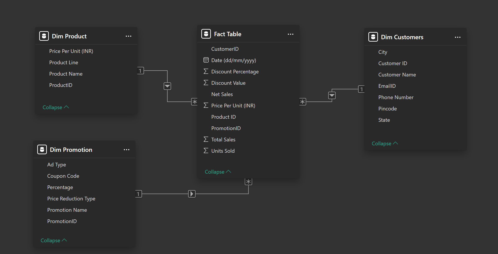
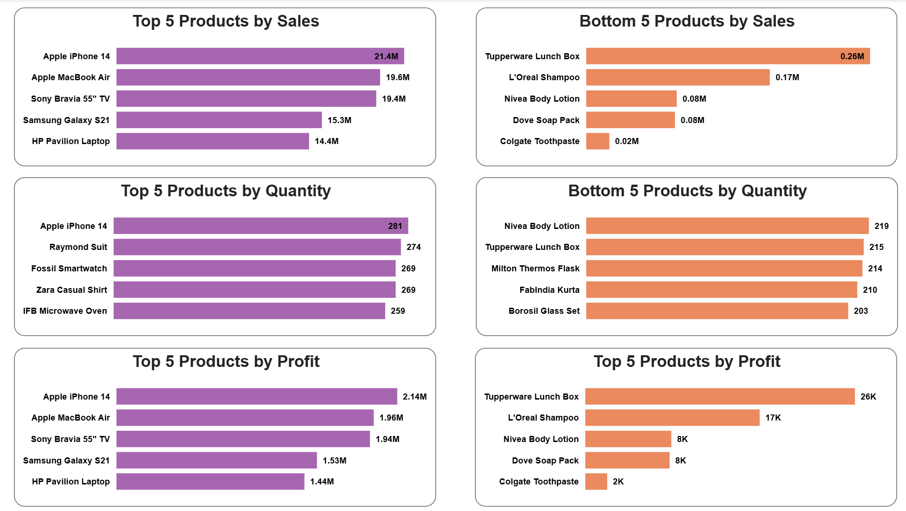

# Power BI Project – Sales Performance Dashboard

This repository contains a **Power BI** report/dashboard focused on analyzing **sales performance** and enabling **order-level exploration** with flexible filtering. The project is from the **Complete Data Analyst Bootcamp From Basics To Advanced** Udemy course. The link of the course: https://www.udemy.com/course/complete-data-analyst-bootcamp-from-basics-to-advanced/

> 📄 **Documentation:** This project is thoroughly documented in the accompanying file (`Sales_Data_Analysis_Documentation.pdf`), which contains detailed explanations of the dataset, Power Query transformations, data model relationships, and report page logic.

## Project Requirements

The report is designed to answer the following business questions and deliverables:

1. **Top/Bottom 5 products** by **Sales / Profit / Quantity Sold**
2. **Sales trends over time** (daily, monthly, quarterly, annually)
3. Visualize the **relationship between Sales and Profit**
4. **Compare** Sales / Profit / Quantity Sold between **any two user-selected periods**
5. **Average discount** offered in each **discount category**
6. **Total number of orders**
7. **Order-level table** showing: **Sales / Profit / Discount / Net Sales / all remaining fields**, filterable via visual filters  
   (e.g., **Product / Date / Customer ID / Promotion Categories**)
8. **Sales by city**

## What’s in this repo

- Power BI report file (`Sales_Data_Analysis.pbix`)
- Data files used for the model (`Store_Data.xlsx`)
- Documentation (`Sales_Data_Analysis_Documentation.pdf`)

## Dataset Structure (`Store_Data.xlsx`)

### Sheets overview

| Sheet | Type | Rows | Columns | Grain | Primary Key |
|------|------|------|---------|------|-------------|
| `Dim Customers` | Dimension | 50 | 7 | 1 row per customer | `Customer ID` |
| `Dim Product` | Dimension | 30 | 4 | 1 row per product | `ProductID` |
| `Dim Promotion` | Dimension | 5 | 5 | 1 row per promotion | `PromotionID` |
| `Fact Table` (`Sheet3`) | Fact | 3510 | 10 | 1 row per transaction line (date × customer × product × promotion) | (composite) |

---

### `Dim Customers` (50 × 7)

| Column | Type | Description |
|--------|------|-------------|
| `Customer ID` | int | Customer identifier (PK) |
| `Customer Name` | text | Customer name |
| `City` | text | City |
| `State` | text | State |
| `Pincode` | int | Postal code |
| `EmailID` | text | Email address |
| `Phone Number` | int | Phone number |

---

### `Dim Product` (30 × 4)

| Column | Type | Description |
|--------|------|-------------|
| `ProductID` | text | Product identifier (PK, e.g., P001) |
| `Product Name` | text | Product name |
| `Product Line` | text | Category / product line |
| `Price (INR)` | int | Unit price in INR |

---

### `Dim Promotion` (5 × 5)

| Column | Type | Description |
|--------|------|-------------|
| `PromotionID` | text | Promotion identifier (PK, e.g., PR001) |
| `Promotion Name` | text | Promotion name |
| `Ad Type` | text | Channel/type (Email, Social Media, etc.) |
| `Coupon Code` | text | Coupon code |
| `Price Reduction Type` | text | Discount rule (e.g., `20% off`) |

> Note: In Power Query we derive a numeric **Percentage** from `Price Reduction Type` (or via conditional mapping).

---

### `Fact Table` (`Sheet3`) (3510 × 10)

| Column | Type | Description | Notes |
|--------|------|-------------|-------|
| `Date (dd/mm/yyyy)` | date | Transaction date | Date range: 2020-01-01 → 2024-01-01 |
| `CustomerID` | int | FK → `Dim Customers[Customer ID]` |  |
| `PromotionID` | text | FK → `Dim Promotion[PromotionID]` | `0` = no promotion |
| `Product ID` | text | FK → `Dim Product[ProductID]` |  |
| `Units Sold` | int | Quantity sold | Range: 1–3 |
| `Price Per Unit` | number | Unit price | **NULL in source** |
| `Total Sales` | number | Sales amount | **NULL in source** |
| `Discount Percentage` | number | Discount % | **NULL in source** |
| `Discount Value` | number | Discount amount | **NULL in source** |
| `Net Sales` | number | Net sales after discount | **NULL in source** |

---

### Data Model (Relationships)

The report uses a **star schema**: one **Fact Table** connected to three dimension tables.

### Relationship details

| Dimension Table | Key (Dimension) | Fact Table Key | Cardinality | Cross-filter direction |
|---|---|---|---|---|
| `Dim Product` | `ProductID` | `Product ID` | 1 → * | Single (Dimension → Fact) |
| `Dim Customers` | `Customer ID` | `CustomerID` | 1 → * | Single (Dimension → Fact) |
| `Dim Promotion` | `PromotionID` | `PromotionID` | 1 → * | Single (Dimension → Fact) |

**Notes**
- This structure enables slicing facts by **Product**, **Customer (City/State)** and **Promotion**.
- Measures such as `Total Sales`, `Discount Value`, and `Net Sales` are calculated at the fact level and aggregate correctly through the dimensions.

---

### Derived columns (created in Power Query due to NULLs in Excel)

| Derived Column | Formula / Logic |
|---------------|------------------|
| `Price Per Unit` | Merge `Fact Table` ↔ `Dim Product` on `Product ID` to bring `Price (INR)` |
| `Discount Percentage` | Merge `Fact Table` ↔ `Dim Promotion` on `PromotionID` to bring mapped `Percentage` |
| `Total Sales` | `Units Sold × Price Per Unit` |
| `Discount Value` | `(Total Sales × Discount Percentage) / 100` |
| `Net Sales` | `Total Sales − Discount Value` |

---

### Top/Bottom 5 product ranking (result & implementation)

A dedicated page was created to benchmark product performance using **Top 5** and **Bottom 5** rankings across key KPIs (Sales, Quantity Sold, Profit). The outcome is a set of bar charts that immediately highlight the highest- and lowest-performing products, making it easy to spot outliers and compare product performance at a glance.

The rankings are implemented using **Power BI visual-level Top N filtering**:
- The filter is applied per visual on **`Product Name`** (Filters pane → **Filters on this visual**).
- **Filter type:** `Top N`
- **Show items:** `Top 5` (and `Bottom 5` for the bottom charts)
- **By value:** Example: `Min of Net Sales`
- The filter is finalized using **Apply filter**.

